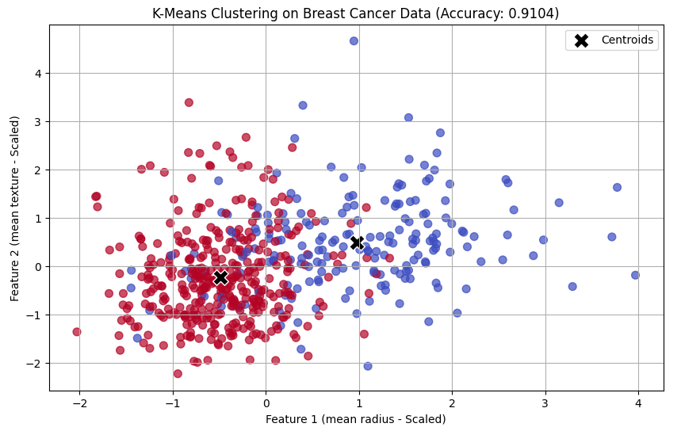
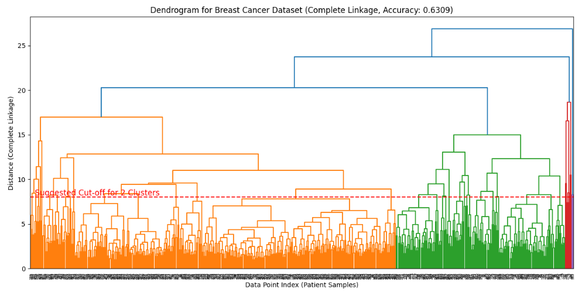
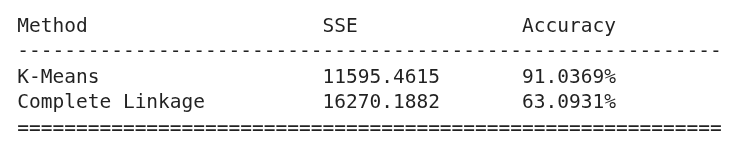

# Jupyter clustering analysis

The analysis compares the K-Means clustering algorithm with the Complete Linkage hierarchical clustering method by evaluating both approaches using two key performance metrics: Sum of Squared Errors (SSE), which measures within-cluster compactness, and accuracy_score, which assesses how well the clustering results match the true labels.

